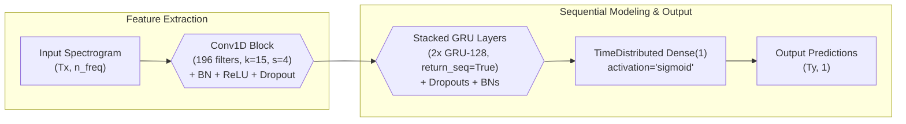

# 🔊 Realtime Wake Word Detection

[](https://keyword-spotting-engine-dlydrlpjcyssh7yyjzemqd.streamlit.app/)

This repository contains an implementation of a wake word detection system. This Streamlit web application allows you to upload your own audio files (WAV) or select from existing examples to detect a specific trigger word, "activate."

The system leverages deep learning techniques for audio signal processing and pattern recognition. Upon processing, the app displays:
* The **spectrogram** of the input audio, visualizing its frequency content over time.
* A **probability graph** showing the model's confidence in detecting the trigger word across the audio duration.
* An **output audio file** where an auditory chime is overlaid at the detected instances of the trigger word.

This project demonstrates key skills in speech recognition, deep learning, and building interactive web applications for AI models.

---

## 📚 Table of Contents

- [Project Overview](#-project-overview)
- [How it Works](#how-it-works)
- [Architectural Design](#architectural-design)
- [Data Synthesis and Preprocessing](#data-synthesis-and-preprocessing)
- [Model Architecture](#-model-architecture)
- [Usage](#usage)
- [Skills Demonstrated](#skills-demonstrated)
- [📁 File Structure](#-file-structure)
- [Future Work](#-future-work)
- [👨‍💻 Author](#-author)

---

## 📝 Project Overview

The objective of this project is to build a robust keyword spotting system capable of detecting the trigger word "activate" in a continuous audio stream. The core of the system is a recurrent neural network (RNN) that processes audio spectrograms to make predictions at a granular, per-timestep level.

**Key features of this project:**

- **End-to-End Pipeline:** From raw audio synthesis to real-time inference.
- **Custom Dataset Generation:** Programmatically creating a diverse and noisy training dataset.
- **Deep Learning Model:** A hybrid Conv1D and GRU-based model for temporal pattern recognition.
- **Practical Application:** The system chimes in response to the detected trigger word, mimicking a real-world application.

This project is a strong demonstration of the principles behind modern speech user interfaces and their underlying machine learning models.

---


## How it Works
1.  **Audio Input**: The app takes a `.wav`.
2.  **Spectrogram Generation**: The audio is converted into a spectrogram, which is a visual representation of the frequencies present in the audio over time. This is what the neural network "sees".
3.  **Neural Network Prediction**: A 1D Convolutional Neural Network (CNN) followed by Gated Recurrent Units (GRUs) processes the spectrogram. It outputs a probability score for each short segment of the audio, indicating how likely a trigger word is present.
4.  **Chime Overlay**: If the probability consistently exceeds a certain threshold (configurable via a slider), a chime sound is overlaid onto the original audio at that specific time, indicating a detected trigger word.

---

## Architectural Design

The system follows a sequential pipeline from data preparation to prediction. The architecture is modular and scalable, allowing for future improvements to the model or dataset.

**Workflow Diagram:**



### 1. Data Synthesis:
- Random "activate" and "negative" (non-trigger) word clips are overlaid onto 10-second background noise recordings.
- Labels (y) are generated programmatically, with 1s marking the time steps immediately following an "activate" event.

### 2. Audio Preprocessing:
- Raw audio is transformed into a spectrogram, a 2D representation of frequency vs. time.
- This converts the raw signal into a format that the neural network can effectively process, as it highlights key auditory features.

### 3. Deep Learning Model:
- The spectrograms are fed into a Conv1D + GRU model.
- The model learns to identify the unique temporal and frequency patterns of the trigger word.

### 4. Inference and Post-processing:
- The model outputs a probability sequence for the entire audio clip.
- A post-processing algorithm detects peaks in this sequence above a certain threshold to trigger the response (the "chime").

---

## Data Synthesis and Preprocessing

A major component of this project is the construction of a robust training dataset from a limited set of raw audio clips.

### Data Synthesis Strategy

To build a large and diverse dataset, we programmatically mixed three types of audio:

- **Positive Examples (`raw_data/activates/`):** Recordings of the word "activate."
- **Negative Examples (`raw_data/negatives/`):** Recordings of other words to act as distractors.
- **Background Noise (`raw_data/backgrounds/`):** Ambient noise from various environments.

This synthesis process ensures the model learns to detect the trigger word even amidst diverse and noisy backgrounds, a critical requirement for real-world applications.

### Audio to Spectrogram Conversion

Instead of using raw audio, which is difficult for a model to interpret, we convert each 10-second audio clip into a spectrogram. The process involves:

- **Short-Time Fourier Transform (STFT):** A window is slid over the audio signal, and a Fourier Transform is applied at each step to determine the frequency content.
- **Dimensionality:** A 10-second audio clip (441,000 samples) is converted into a spectrogram of shape (101, 5511). This reduction in dimensionality makes the problem tractable for the model.

---

## 🧠 Model Architecture

The deep learning model is a sophisticated sequence model designed for time-series data like spectrograms.

**Model (`model.ipynb`):**

```python
def modelf(input_shape):
    X_input = Input(shape=input_shape)

    # 1D Convolutional Layer for feature extraction
    X = Conv1D(filters=196, kernel_size=15, strides=4)(X_input)
    X = BatchNormalization()(X)
    X = Activation('relu')(X)
    X = Dropout(rate=0.8)(X)

    # First GRU Layer
    X = GRU(units=128, return_sequences=True)(X)
    X = Dropout(rate=0.8)(X)
    X = BatchNormalization()(X)

    # Second GRU Layer
    X = GRU(units=128, return_sequences=True)(X)
    X = Dropout(rate=0.8)(X)
    X = BatchNormalization()(X)
    
    # Time-Distributed Dense layer for per-timestep prediction
    X = TimeDistributed(Dense(1, activation='sigmoid'))(X)

    model = Model(inputs=X_input, outputs=X)
    return model
```
---

- **Conv1D Layer:** Acts as a feature extractor, identifying small, local patterns in the spectrogram that are indicative of human speech, such as formants and phonemes.

- **Stacked GRU Layers:** Gated Recurrent Units are used to capture long-term dependencies across the time dimension of the spectrogram. They are more computationally efficient than LSTMs while still being highly effective.

- **TimeDistributed(Dense) Layer:** This layer applies the same dense layer to every time step of the GRU's output, enabling the model to make a prediction for each small slice of the audio.

- **Loss and Metrics:** The model is compiled with binary_crossentropy and uses custom F1-score metric to handle the imbalanced nature of the data (most of the audio is silence or negative words).

---

 ## Usage
Follow these steps to set up the project locally.

```bash
git clone https://github.com/nabeelshan78/keyword-spotting-engine.git
cd trigger_word_detection
```

---

### 1. Data Preparation
Run the processing.ipynb notebook to generate the training and development datasets from the raw audio files.

```bash
jupyter notebook processing.ipynb
```

This notebook will create the processed_data/ and XY_dev/ directories.

### 2. Model Training
Open and run the model.ipynb notebook to train the deep learning model and save the weights.

```bash
jupyter notebook model.ipynb
```

The trained model weights and architecture will be saved to the model/ directory.


### 3. Real-time Inference
Use the functions within model.ipynb to test the model on new audio. The detect_triggerword() function will visualize the model's predictions, and chime_on_activate() will produce the output audio with a chime.

---

## Skills Demonstrated
This project is a comprehensive showcase of expertise in several critical areas of modern machine learning and software engineering.

- **Audio Signal Processing:** In-depth understanding of converting raw audio into spectrograms, a crucial step for feature extraction in speech applications.

- **Deep Learning (DL):** Expertise in designing, implementing, and training a hybrid CNN-RNN model using TensorFlow and Keras. Demonstrated knowledge of recurrent networks (GRUs) for sequence modeling.

- **Data Engineering / MLOps:** Developed a robust data synthesis pipeline to programmatically generate training data, a common and critical practice in real-world ML projects with limited data.

- **Model Evaluation:** Utilized custom metrics (F1-score) to handle dataset imbalances, showing a nuanced understanding of model performance evaluation beyond simple accuracy.

- **Software Development:** Wrote clean, modular code (utils.py) and provided detailed documentation, reflecting a professional standard for project maintainability and collaboration.

---


## 📁 File Structure
```
keyword-spotting-engine.
├── chime.wav                       # The audio chime file
├── model/
│   ├── model.h5                    # Trained model weights
│   └── model.json                  # Model architecture
├── output/
│   └── ...                         # Output audio files with chimes
├── processed_data/
│   ├── train_X.npy                 # Processed training spectrograms
│   └── train_Y.npy                 # Processed training labels
├── raw_data/
│   ├── activates/                  # Raw audio of the word "activate"
│   ├── backgrounds/                # Background noise clips
│   └── negatives/                  # Raw audio of other words
├── XY_dev/
│   ├── X_dev.npy                   # Development set spectrograms
│   └── Y_dev.npy                   # Development set labels
├── model.ipynb                     # Jupyter notebook for model training and inference
├── processing.ipynb                # Jupyter notebook for data synthesis and preprocessing
├── utils.py                        # Helper functions for the project
└── README.md
```
---

## 🔮 Future Work
- **Performance Optimization:** Explore quantization techniques or model pruning to deploy the model on resource-constrained devices (e.g., Raspberry Pi).

- **Larger Dataset:** Expand the data synthesis pipeline to include a wider variety of voices, languages, and background noises for a more generalized model.

- **Bidirectional GRU:** Experiment with a Bidirectional GRU to capture dependencies from both past and future time steps for potentially improved accuracy.

- **New Trigger Words:** Adapt the pipeline to detect a different trigger word, making the system more flexible.

---


## 👨‍💻 Author

**Nabeel Shan**  
Software Engineering Student @ NUST Islamabad, Pakistan  
Aspiring AI/ML Engineer | Deep Learning & NLP Enthusiast

* [LinkedIn](https://www.linkedin.com/in/nabeelshan)
* [GitHub](https://github.com/nabeelshan78)

- Currently diving deep into Sequence Models — mastering RNNs, LSTMs, Attention Mechanisms, and building practical applications like Neural Machine Translation (NMT).
- Passionate about AI research, contributing to open-source, and pursuing advanced studies in AI/ML.
- Always open to collaborations on NLP, Generative AI, or Machine Learning Engineering projects. Let’s build something impactful together!

---

## Support This Project
If you found this project helpful or insightful, please consider starring 🌟 this repository. It supports open-source efforts and helps others discover meaningful and educational ML resources. Thank you!


